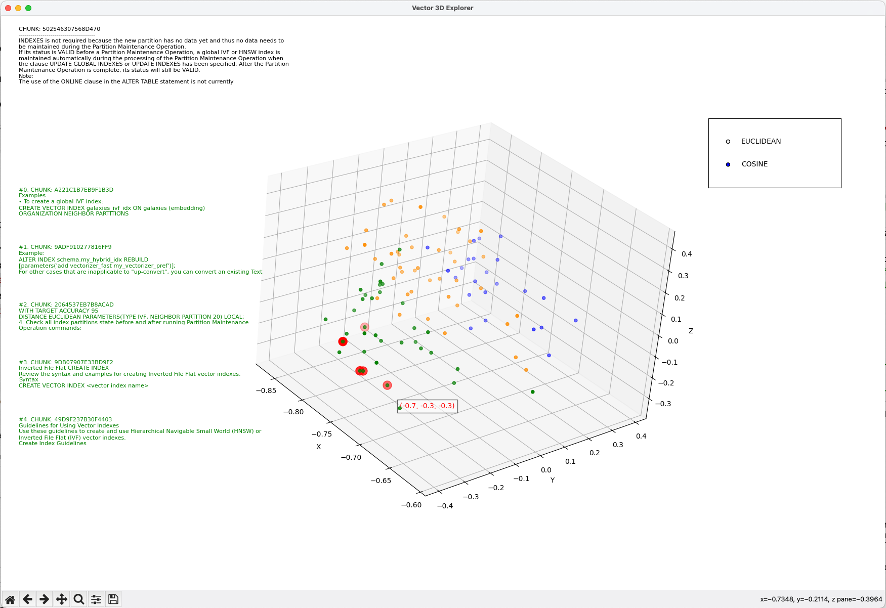
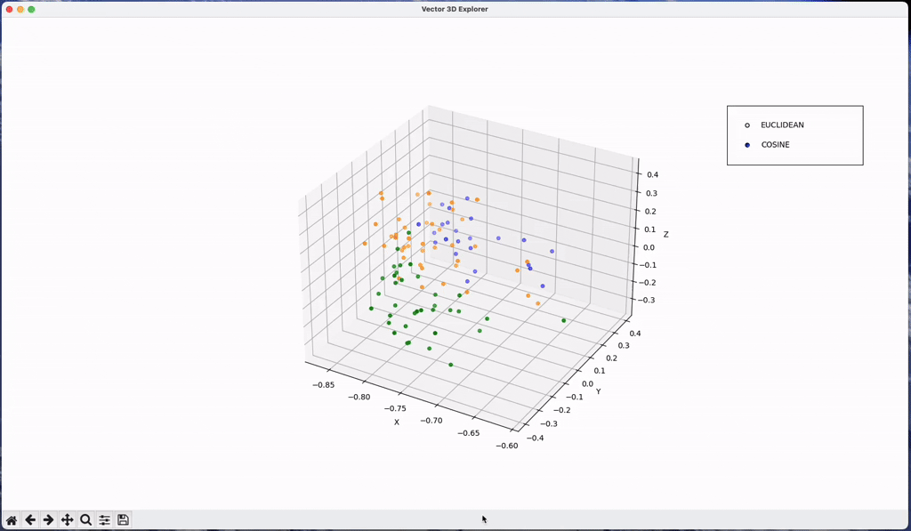

# A Vector 3D explorer

*An interactive 3D explorer for vector embeddings stored in **Oracle DB 23ai**, using **Oracle Machine Learning** in-database models.*

This project demonstrates how Oracle Machine Learning can be leveraged inside Oracle DB 23ai to analyze and manipulate embedding vectors **without exporting them**. It uses the [In-Database Algorithms support for VECTOR data type predictors](https://docs.oracle.com/en/database/oracle/oracle-database/23/vecse/january-2025-release-update-23.7.html), introduced in release **23.7**. More details are available [here](https://docs.oracle.com/en/database/oracle/machine-learning/oml4sql/23/dmprg/data-requirements.html#GUID-AC1CDD37-0DFE-4EBF-A5E0-94F1234279B9).

Inspired by the examples in this [blog post](https://blogs.oracle.com/machinelearning/post/announcing-vector-support-for-indatabase-machine-learning-algorithms), I developed a sample browser to enable more intuitive interaction with a vector store compared to a flat table of chunks and embeddings, such as those created with `langchain_community.vectorstores.oraclevs`.:

- Visualize a vector store as a **text-chunks cloud** in 3D space.
- Show the **top-K nearest vectors** to a selected one.
- Display the related text contents.

This is primarily an educational exercise to illustrate how OML can be re-imagined in the era of vector stores. More examples will follow.



---

## How It Works

The process makes the original embeddings viewable in a 3D dot cloud using **dimensionality reduction**. Normally, this requires exporting vectors, processing them externally, and re-importing them. With OML in Oracle DB 23ai, the transformation happens **entirely in-database**, and the results can be queried and stored directly.  

Since large numbers of vectors can clutter the visualization, the explorer supports:
- Random uniform sampling of vectors.
- Clustering to group and colorize vectors for clarity.

Below is the step-by-step workflow:

---

### 1. Create a Sample Subset

A subset of the original table generated by the LangChain Vector Store API is created to work with a fixed, reproducible sample.

```sql
CREATE TABLE {table_vect} AS
    SELECT 
        RAWTOHEX(ID) AS ID,
        EMBEDDING,
        TEXT
    FROM (
        SELECT *
        FROM {base_table}
        ORDER BY STANDARD_HASH(ID || '{CFG.seed}', 'SHA1')
    )
    FETCH FIRST {CFG.pca_fit_rows} ROWS ONLY;
```

- `ORDER BY STANDARD_HASH(...)`: redistributes rows randomly but deterministically (using a fixed seed).  
- `FETCH FIRST ...`: limits the sample size to execute the PCA and Clustering algorithms. You can increase as you prefer with the trade-off of a longer computation in-DB.

---

### 2. Train a Dimensionality Reduction Model

```sql
DECLARE
    v_setlst DBMS_DATA_MINING.SETTING_LIST;
BEGIN
    v_setlst('ALGO_NAME')         := 'ALGO_SINGULAR_VALUE_DECOMP';
    v_setlst('SVDS_SCORING_MODE') := 'SVDS_SCORING_PCA';
    v_setlst('FEAT_NUM_FEATURES') := '3';

    DBMS_DATA_MINING.CREATE_MODEL2(
        MODEL_NAME          => '{pca_model}',
        MINING_FUNCTION     => 'FEATURE_EXTRACTION',
        DATA_QUERY          => 'SELECT EMBEDDING FROM {table_vect}',
        CASE_ID_COLUMN_NAME => NULL,
        SET_LIST            => v_setlst
    );
END;
```

- `ALGO_SINGULAR_VALUE_DECOMP`: applies Singular Value Decomposition (SVD).  
- `SVDS_SCORING_PCA`: reduces data to principal components.  
- `FEAT_NUM_FEATURES = 3`: produces a 3D representation.

[Reference](https://docs.oracle.com/en/database/oracle/machine-learning/oml4py/2/mlpug/singular-value-decomposition.html)

---

### 3. Create a 3D View of Embeddings

```sql
CREATE OR REPLACE VIEW {view_reduced} AS
SELECT
    ID,
    VECTOR_EMBEDDING({pca_model} USING *) AS EMBEDDING3D,
    TEXT,
    EMBEDDING
FROM {table_vect};
```

- Adds a new `EMBEDDING3D` column with reduced 3D vectors.

---

### 4. Apply Clustering for Visualization

```sql
DECLARE
    v_setlist DBMS_DATA_MINING.SETTING_LIST;
BEGIN
    v_setlist('ALGO_NAME')        := 'ALGO_KMEANS';
    v_setlist('PREP_AUTO')        := 'ON';
    v_setlist('KMNS_DISTANCE')    := 'KMNS_EUCLIDEAN';
    v_setlist('KMNS_DETAILS')     := 'KMNS_DETAILS_ALL';
    v_setlist('KMNS_ITERATIONS')  := '10';
    v_setlist('KMNS_NUM_BINS')    := '10';
    v_setlist('CLUS_NUM_CLUSTERS'):= '{top_k}';
 
    DBMS_DATA_MINING.CREATE_MODEL2(
        MODEL_NAME          => '{table}_KM_SH_CLUS1',
        MINING_FUNCTION     => 'CLUSTERING',
        DATA_QUERY          => 'SELECT EMBEDDING FROM {table}',
        SET_LIST            => v_setlist,
        CASE_ID_COLUMN_NAME => NULL
    );
END;
```

- Uses **K-Means** to partition vectors into `{top_k}` clusters.  
- Each cluster can be visualized with a distinct color.

---

### 5. Sample Again for Plotting

```sql
CREATE TABLE {sampled_view} AS
    SELECT *
    FROM (
        SELECT *
        FROM {view_name}
        ORDER BY STANDARD_HASH(ID || '{CFG.seed}', 'SHA1')
    )
    FETCH FIRST {n} ROWS ONLY;
```

- `{n}`: defined by the `--subset-dim-plot` parameter.  
- Useful for very large datasets and to manage in-memory a subset of vectors/chunks pair to inspect the vector store created

---

### 6. Perform Similarity Search on Click

When clicking a point, the nearest top-K vectors are retrieved:

```sql
SELECT ID
FROM {table_vect}
ORDER BY VECTOR_DISTANCE(
    EMBEDDING,
    (SELECT EMBEDDING FROM {table_vect} WHERE ID = :1),
    {metric}
)
FETCH EXACT FIRST {n} ROWS ONLY;
```

- Highlights the nearest vectors.  
- Displays their associated text in the interface.


### Final chart:
In green the TopK chunks retrieved nearer the vector selected, and in the top left corner the text content of a selected vector:




---

## Getting Started

### 1. Install Environment

```bash
python3.11 -m venv .venv
source .venv/bin/activate
pip install oracledb numpy matplotlib
```

### 2. Install Oracle Instant Client

Download from [Oracle Instant Client Downloads](https://www.oracle.com/database/technologies/instant-client/downloads.html).  
Set the environment variable, for example:

```bash
export LIB_DIR="/Users/cdebari/instantclient_23_3"
```

### 3. Run the Application

Either via command line or with the provided [start.sh](start.sh) script. This is an example:

```bash
source .venv/bin/activate
python vector_3d_explorer.py  --dsn "localhost:1521/FREEPDB1" --user "vector" --password "vector" --table "OLLAMA_MXBAI_EMBED_LARGE_8192_1639_COSINE_HNSW" --distance-metric-default "EUCLIDEAN"  --topk 5 --subset-dim 500 --subset-dim-plot 100
```

--

**Copyright (c) 2025 Corrado De Bari** 

Released under the MIT License.
